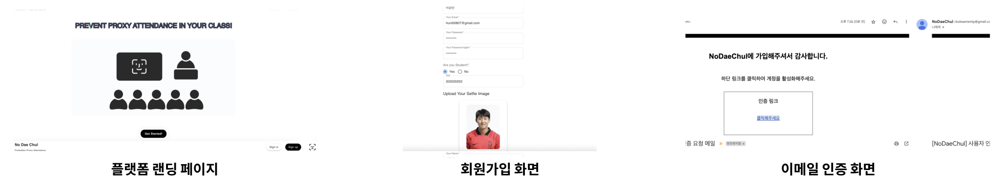
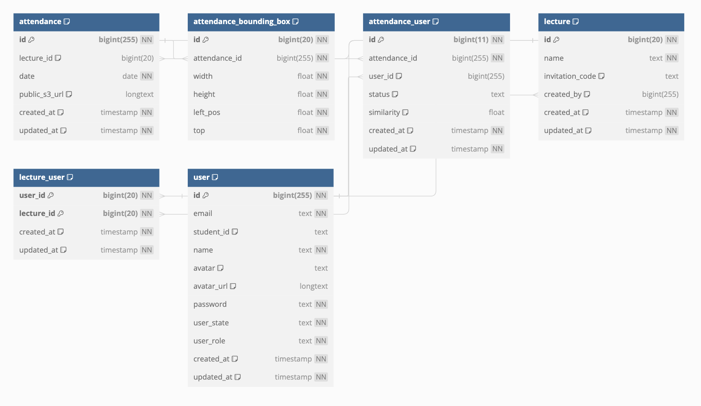
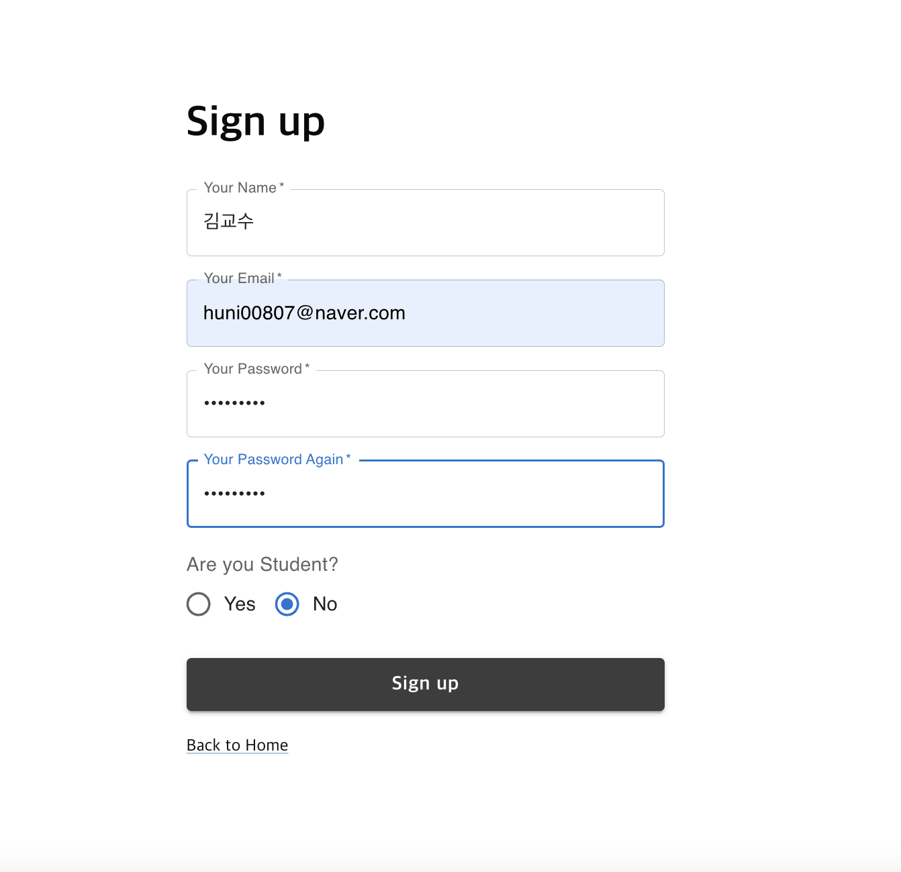
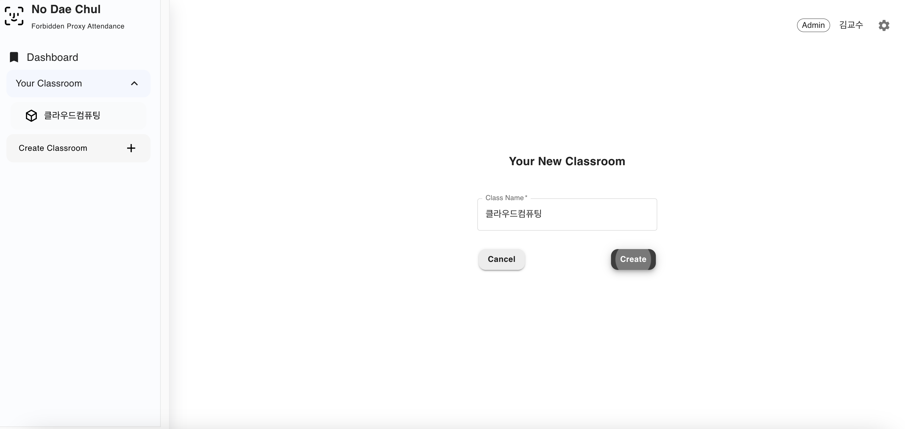
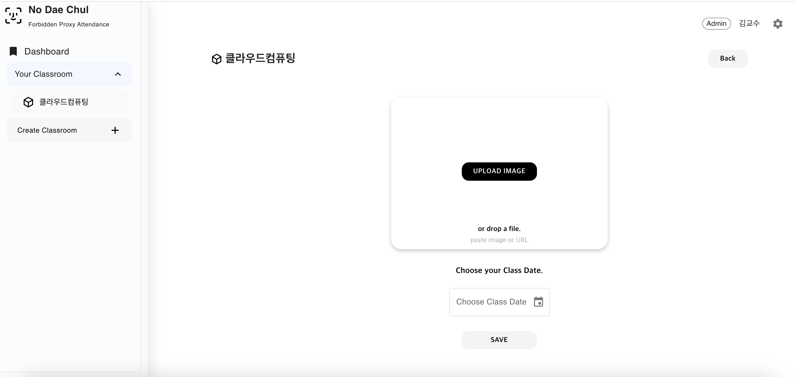
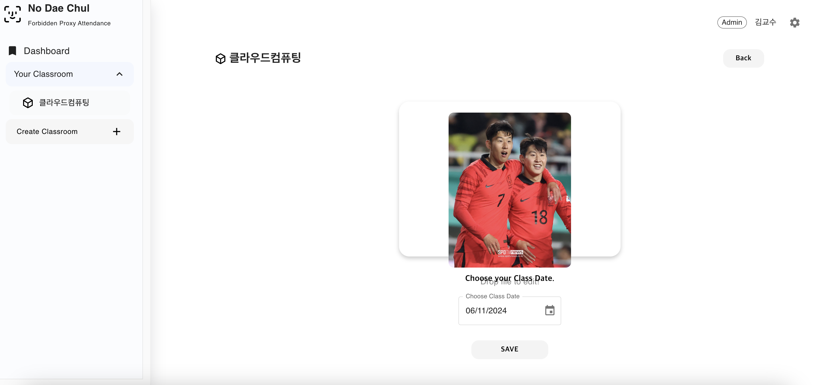
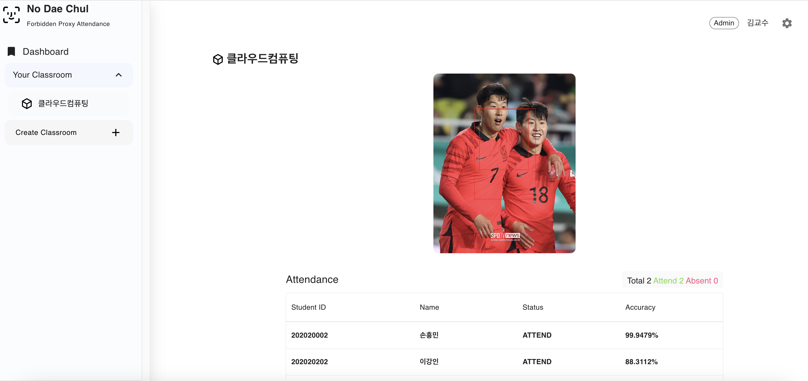
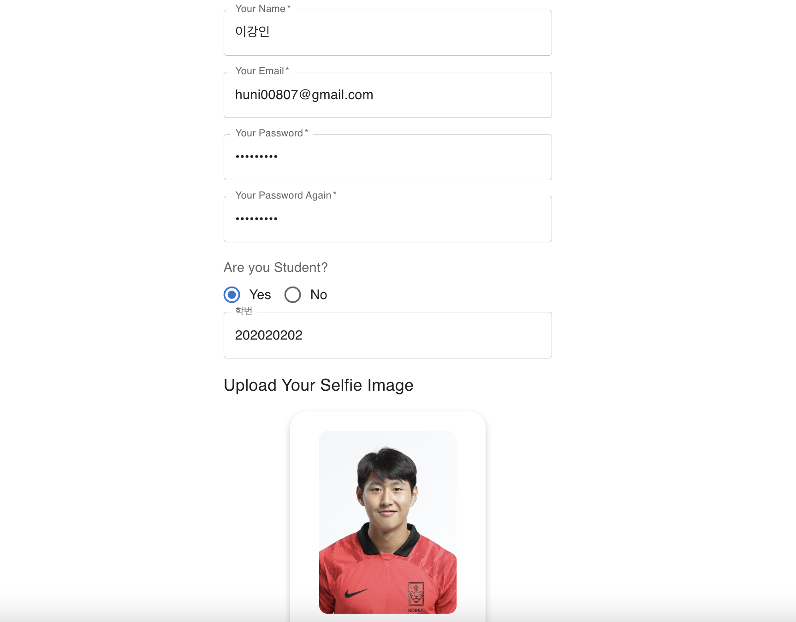

# NoDaeChul

- 해당 프로젝트는 대학 내 빈번하게 발생하는 **대리출석 방지**를 위한 **안면 인식 기반 출석 시스템**입니다.
- 이 프로젝트를 통해 출석 과정의 **신뢰성**과 **공정한 학습 환경**을 조성하는데 도움을 줄 수 있습니다.

## 프로젝트 멤버 및 담당파트
| 멤버                                                                                                                                                                                                                                   | 소속 및 학번                | 주 개발 분야 | 세부 역할                                                                                                        |
|--------------------------------------------------------------------------------------------------------------------------------------------------------------------------------------------------------------------------------------|------------------------|--------|--------------------------------------------------------------------------------------------------------------|
| 
    [hunsy9](https://github.com/hunsy9) (유승훈) 
 | 정보컴퓨터공학   201924515 | 백엔드 및 인프라 | - 기획 및 디자인   - 웹 서버 어플리케이션 개발(회원, 출석부 도메인)   - AWS S3 및 Rekognition 파이프라인 개발 및 배포   - 데이터베이스 스키마 설계 |
| 
    [ssigner](https://github.com/ssigner) (김종훈) 
 | 정보컴퓨터공학   201924442  | 프론트엔드  | - 웹 프론트 (React Component) 개발   - 프론트엔드, 백엔드 간 API 연동(js-fetch 사용)                                         |
| 
    [J-1ac](https://github.com/J-1ac) (이상준) 
 | 정보컴퓨터공학   201924530  | 백엔드    | - 웹 서버 어플리케이션 개발(수업 도메인)   - 데이터베이스 스키마 설계                                                                |
| 
    [seyoung4503](https://github.com/seyoung4503) (최세영) 
 | 정보컴퓨터공학   201924595  | 프론트엔드  | - 웹 프론트 (React Component) 개발   - 데이터베이스 스키마 설계                                                            |

## 프로젝트 소개
- 위 서비스는 **편리하고 신뢰할 수 있는 출석 체크 시스템**을 제공하는 것을 목표로 합니다.
- 현재 강의실의 사진을 **AWS Rekognition**를 통해 수업에 참여중인 학생들의 얼굴 특징 벡터를 추출한 후 DB에 저장된 학생의 사진과 비교함으로써 학생이 출석했는지 확인할 수 있습니다.

## 프로젝트의 필요성
- 부산대학교에서 이용 중인 LMS 서비스인 [PLATO](https://plato.pusan.ac.kr/)의 스마트 출석부 시스템은, 교수가 수업 시작 시 출석 코드를 학생들에게 알려주고, 학생이 제한 시간 내에 출석코드를 입력을 함으로써 출석이 되는 방식입니다.
- 그러나 해당 시스템은 수업에 참여한 학생이 수업에 참여하지 않은 학생에게 **원격으로 출석코드를 알려줌**으로써, 일종의 **대리출석**이 가능하다는 약점이 있습니다.
- 또한, 교수님이 **직접 호명하여 출석부에 체크하는 방식**도 있지만 사람이 많은 수업의 경우 출석체크를 하는 시간이 오래 걸린다는 단점이 있습니다.

따라서 수업 시작 시, 교수님이 **강의실 전경(학생들의 얼굴) 사진을 찍어 출석부를 생성**함으로써, **대리출석도 방지**하고 **출석 시간도 단축**시킬 수 있는 플랫폼인 NoDaechul을 고안하였습니다.

## 관련 기술/논문/특허 조사 내용 소개
[Face Recognition based Attendance Management System](https://www.researchgate.net/publication/341876647_Face_Recognition_based_Attendance_Management_System)
- 위 논문에 따르면 데이터 베이스 생성, 얼굴 감지, 얼굴 인식, 출석 업데이트로 총 4 단계를 거쳐 학생들의 출석 여부를 감지
- 이때 데이터 베이스는 출석한 학생들의 이미지들로 구성되며 얼굴 감지와 얼굴 인식은 각각 Haar-Cascade  classifier  와 Local  Binary Pattern  Histogram  알고리즘을 수행
- 얼굴은 수업의 live streaming을 통해 감지되며 수업이 끝난 후에 교수님께 출석부 명단을 이메일로 전송
- 이 시스템은 zoom과 같은 온라인 수업 환경에서 출석을 체크하기 위해 개발되었음.

[Face Recognition Based Attendance System](https://ieeexplore.ieee.org/document/10146718) 
- 첫번째 논문과 유사하게 위 논문에서도 OpenCV 라이브러리와 LBPH 알고리즘과 Harr-Cascade 알고리즘을 사용해서 얼굴인식 시스템을 구현하고 있음.

## 프로젝트 개발 결과물

실제 배포된 프로젝트는 [www.nodaechul.site](http://nodaechul.site)에서 확인하실 수 있습니다.

### 주요 기능 및 화면

### 아키텍처 및 데이터 흐름

  

 

1. 초기에 AWS IAM을 통해서 얻은 자격 증명 객체를 스프링 부트 Bean으로 주입됩니다.
2. 회원가입 시 학생들의 정보(이름, 학번) 및 학생 S3 정보(S3 Image Key, public url) 은 플랫폼 데이터베이스에, 셀프카메라 사진은 AWS S3에 저장됩니다.
3. 회원가입 시 AWS Rekognition의 IndexFaces API를 호출하여 얼굴 사진을 분석하고, 얼굴 특징 벡터를 추출하여 Rekognition 컬렉션 및 S3에 저장합니다.
4. 매 수업 시작 시, 출석 체크를 위한 강의실 전경 사진을 촬영 후 S3로 업로드합니다. 
5. S3에 업로드된 출석 체크 사진에 대해 AWS Rekognition의 SearchFacesByImage API를 호출하여 컬렉션 내부에 있는 학생들의 얼굴을 검색합니다.
6. 매칭된 얼굴의 정보(등록된 학생 이름, 학번 등)를 반환, 교수자는 웹 인터페이스를 통해 매 수업 별 출석 결과를 확인합니다.

### ERD

- **user 테이블**
  - 회원들의 정보(이름, 학번, 프로필 사진, 프로필 사진 url)가 저장되는 테이블
- **lecture 테이블**
  - 교수자가 수업 생성 시, 레코드 생성
  - 수업 이름 및 수업의 초대코드(UUID)가 저장되는 테이블
- **lecture_user 테이블**
  - 학생(수강자)이 교수자가 준 초대코드를 통해 수업에 참여 시, 레코드 생성
  - 학생과 수업은 N:M 관계임
- **attendance 테이블**
  - 교수자가 출석부 생성 시, 레코드 생성
- **attendance_bounding_box 테이블**
  - SearchFacesByImage API를 통해서 검색된 얼굴들의 Bounding Box 정보를 저장
- **attendance_user 테이블**
  - 출석부 생성 시, 수업 전경 사진에서 검색된 학생들의 출석 정보를 저장

### 프론트엔드 컴포넌트 트리

## 개발 결과물을 사용하는 방법

### 교수자 기준
1. 교수자는 위 웹서비스에 회원가입을 한 뒤, 수업을 생성합니다. (교수자는 회원가입 시 셀프카메라 불필요)

2. 수업 생성 이후, Invite Member 버튼을 클릭하여 초대코드를 복사하여 수업 내 학생들에게 알려줍니다.

3. 수업 시작 시, 수업 전경(학생들의 얼굴) 사진을 찍어, 당일 날짜와 함께 출석부를 생성합니다.

### 학생(수강생) 기준
1. 학생은 기본 정보 및 셀프카메라 사진을 바탕으로 회원가입을 합니다.

2. 교수자가 알려준 수업 초대 코드를 입력하여 수업에 참여합니다.

3. 이후 교수자가 생성한 출석부를 확인 가능합니다.

